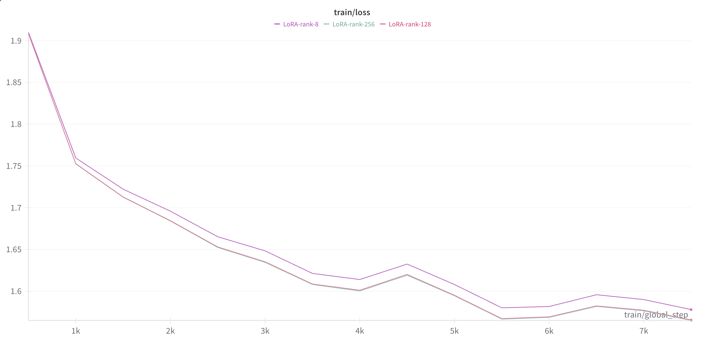
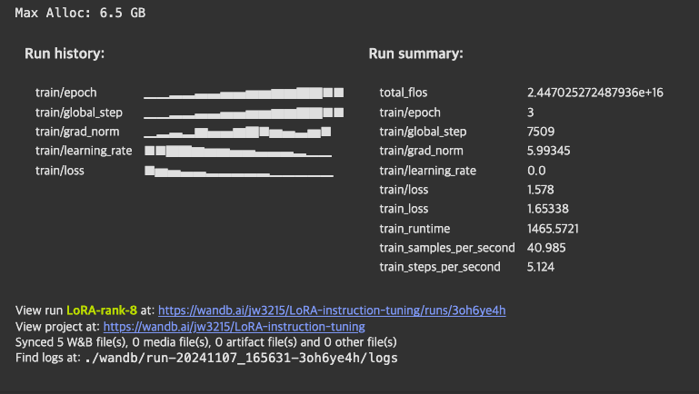
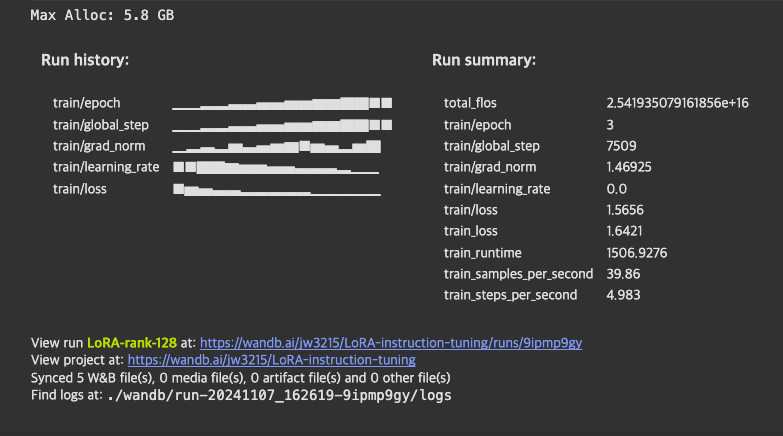
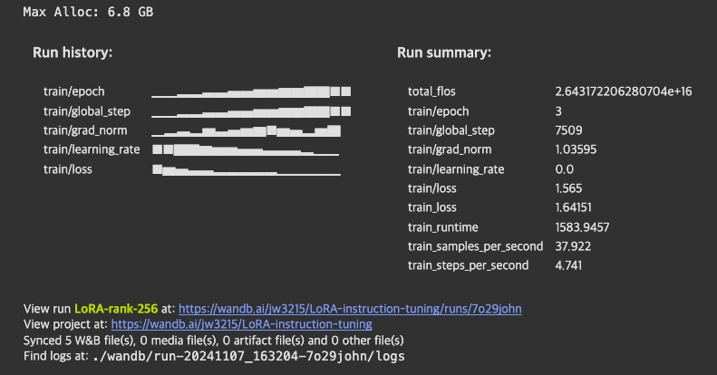

# 기본 과제

## loss 그래프

- [wandb 링크](https://api.wandb.ai/links/jw3215/ivai6or3)

## LoRA rank 별 메트릭

1. rank 8

2. rank 128

3. rank 256

## 정리

|         |  rank 8    | rank 128     |  rank 256    |
|----------|-----------|-----------|-----------|
| 메모리 점유 | 6.5 GB  | 5.8 GB | 6.8 GB |
| 학습 시간 | 1466 sec  | 1506 sec | 1584 sec |
| loss  | 1.578 | 1.566 | 1.565   |

- A100 GPU 기준
- rank가 낮을 수록 메모리 점유율이 적고, 학습시간이 짧다.
    - rank 128이 rank 256 보다 점유율이 낮은데, 다른 요인일 것
    - 병렬 연산이라 학습시간 차이가 그렇게 크지는 않다.
    - 차이가 나는 부분은 병렬화에 쓰이는 시간일 것
- rank 128과 rank 256의 loss가 거의 동일하다.
    - 오버피팅이 있었다면, 256의 loss가 더 낮았을 것.
    - 변경하는 파라미터의 비율이 압도적으로 적은 것이 원인일 듯.
    - rank가 2배인데도, 결과가 동일한 것을 보아. 최적의 rank를 이분 탐색으로 찾는 것도 합리적이지 않을까? (e.g. (128 + 8) / 2 = 68)
    
## notebook

- [rank 8](./notebooks/LoRA-8.ipynb)
- [rank 128](./notebooks/LoRA-128.ipynb)
- [rank 256](./notebooks/LoRA-256.ipynb)

