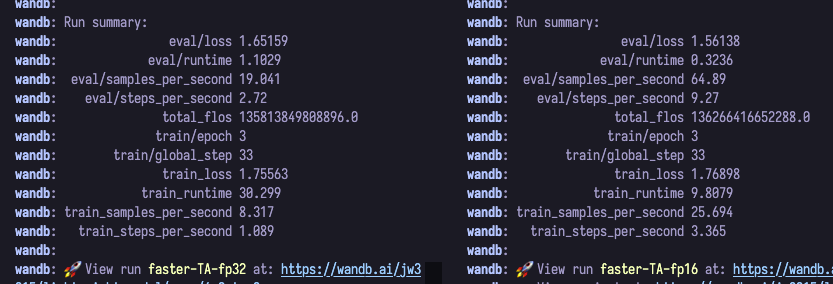

# 심화 과제

[Chapter 4-1 심화과제](https://github.com/hanghae-plus-AI/AI-1-jw3215/tree/main/Chapter4/Chapter4-1/%EC%8B%AC%ED%99%94%EA%B3%BC%EC%A0%9C)를 대상으로 모델 경량화 했습니다.

## FP16 vs FP32

- fp32(기본 설정)에서 fp16으로 quantization

|       | fp32     | fp16     |
|-----------|-----------|-----------|
| train loss   | 1.7556 | 1.7690 |
| eval loss   | 1.6516 | 1.5614 |
| 학습 시간   | 30.24 sec | 9.81 sec |

- train loss와 eval loss는 거의 변동 없음
- 학습 시간 약 1/3 로 감소
- fp16의 eval loss가 더 작은 것은, 데이터셋 자체가 작은 것이 원인이 아닐지
